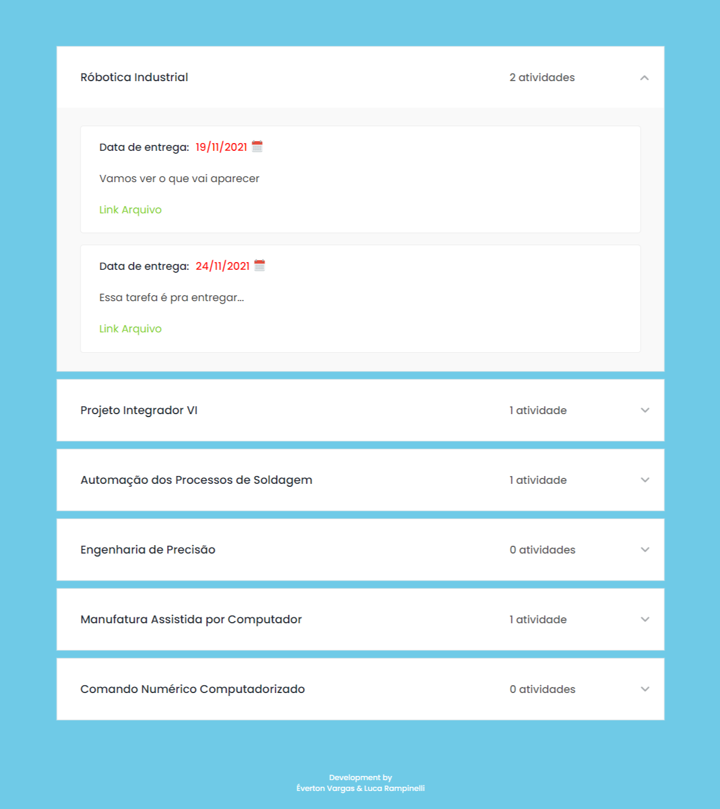

# Atividades da Faculdade

<h1 align="center">
    
</h1>

## 🚀 O desafio

Fazer um site para ver quais são as tarefas da faculdade que estão pendentes. Dado que estamos mais perdidos que cego em tiroteio kkkkkkk

## :crystal_ball: Technologies

Este projeto foi desenvolvido utilizando as seguintes tecnologias:
- [React](https://reactjs.org)
- [TypeScript](https://www.typescriptlang.org/)
- [NextJs](https://nextjs.org/)
- [Sass](https://sass-lang.com/)
- [Supabase](https://supabase.io/)
- [date-fns](https://date-fns.org/)